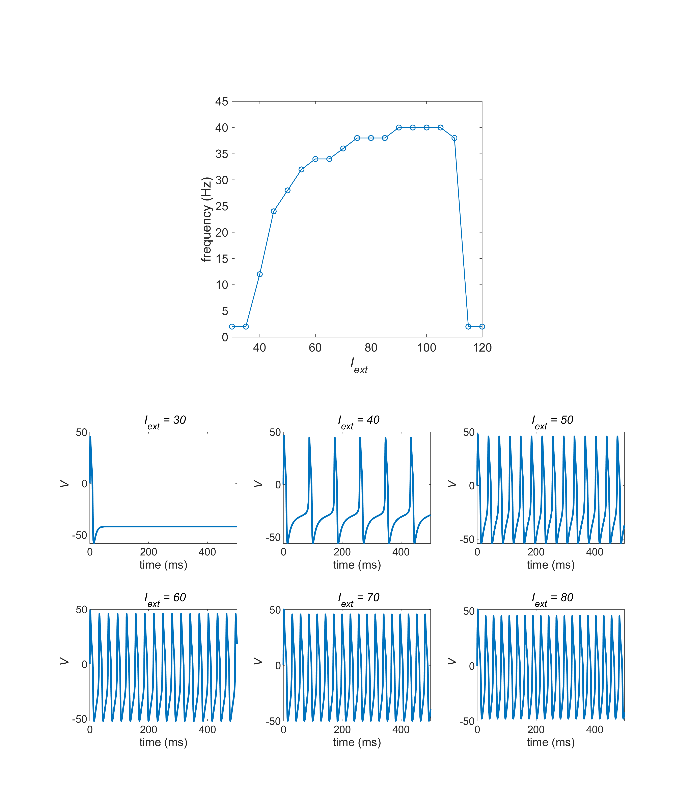

# Demo_MorrisLecar 
MATLAB demo script of Morris Lecar Model

# Example of the results
The code generating the following figure is found in ex3_I_f_plot.m. 
(Typical F-I curve profile of type I mode)

# Authors 
&ensp; Hiroshi Yokoyama 
&ensp;&ensp;(Division of Neural Dynamics, Department of System Neuroscience, National Institute for Physiological Sciences, Japan) 
