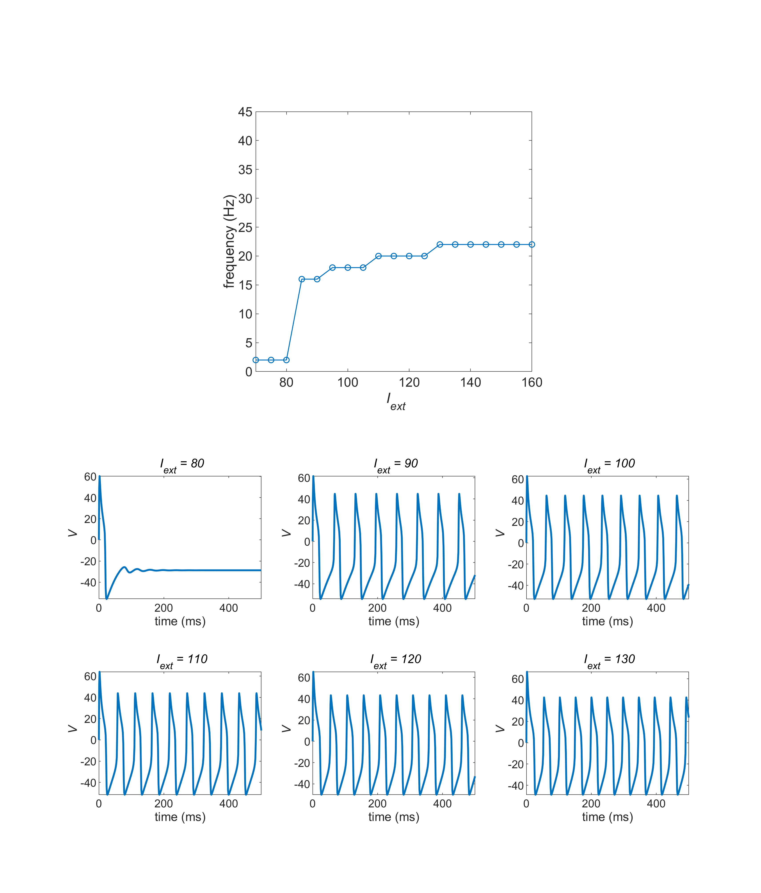
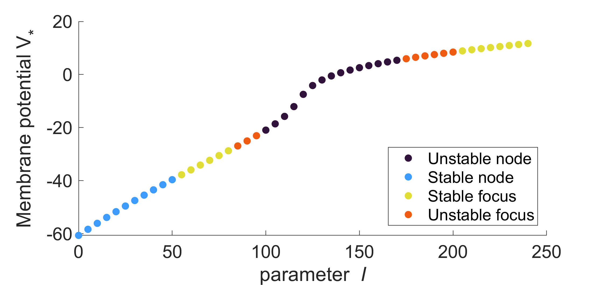

# Demo_MorrisLecar 
Sample of MATLAB implementation for stability analysis in Morris Lecar Model

# Example of the results
 
  

The code generating the above figures are found in "ex3_I_f_plot.m" and "ad_ex2_bifurcation.m". 
These figures showed typical bifurcation diagrams with type II excitability.

# Authors 
&ensp; Hiroshi Yokoyama 
&ensp;&ensp;(Division of Neural Dynamics, Department of System Neuroscience, National Institute for Physiological Sciences, Japan) 
